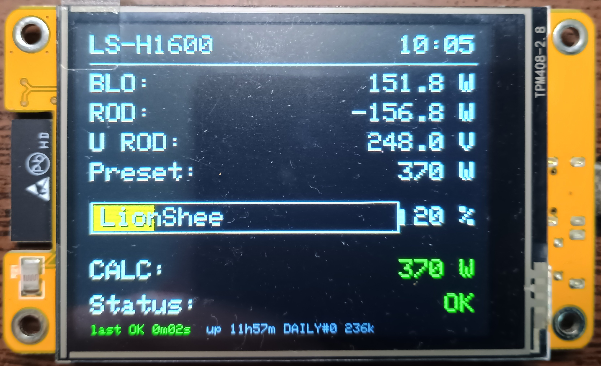
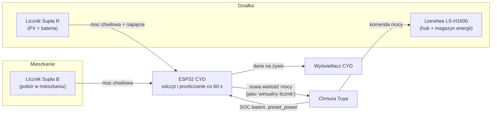

Inteligentne sterowanie oddawaniem energii z magazynu Lionshee LS-H1600
Punkt wyjścia
Mieszkam w bloku i nie mogę mieć własnej instalacji fotowoltaicznej. Pod miastem posiadam jednak działkę wypoczynkową, a z pomocą przyszedł mi prosument wirtualny — instytucja wprowadzona 2 lipca 2025 roku, pozwalająca rozliczać energię z instalacji w jednym miejscu na potrzeby zużycia w innym.
Na działce stoi instalacja fotowoltaiczna z magazynem energii — hub Lionshee LS-H1600. Standardowo taki hub oddaje prąd do sieci według własnej, dość sztywnej logiki albo na podstawie odczytu z licznika energii podłączonego do tej samej sieci WiFi. Chciałem, żeby robił to mądrzej: żeby moc oddawana z baterii była na bieżąco dopasowywana do tego, co faktycznie zużywam w mieszkaniu — ile energii aktualnie pobieram, a ile w tym samym czasie produkuje fotowoltaika na działce.
Producent nie daje do tego żadnego API do własnych integracji. Jedyna furtka to aplikacja Tuya (w której działa LS-H1600) i sztuczka, na którą pozwala: w ustawieniach można „podpiąć” pod hub „wirtualny licznik energii” — konkretnie model, którego dane hub traktuje jako podstawę do decyzji o mocy. To otworzyło drzwi do własnego sterowania: wystarczy oszukać hub, podając mu dokładnie takie dane, jakich oczekuje od prawdziwego licznika. To pewne uproszczenie — w praktyce sterujemy raczej harmonogramem oddawania energii niż samym licznikiem.
Ekran CYD w akcji

Ekran pokazuje na żywo: moc z licznika w mieszkaniu (BLO), moc i napięcie z licznika na działce (ROD, U ROD), aktualny preset mocy, poziom naładowania baterii (LionShee), wyliczoną wartość mocy (CALC) oraz status działania systemu wraz z czasem od ostatniego udanego cyklu i czasem pracy urządzenia (uptime).
Schemat działania

Jak to działa w skrócie
Sercem systemu jest tania płytka ESP32 z wbudowanym wyświetlaczem (tzw. CYD — Cheap Yellow Device). Co minutę robi ona trzy rzeczy:
Odczytuje dwa liczniki energii podłączone do mojej instalacji (przez usługę Supla) — jeden w mieszkaniu, drugi na działce.
Odczytuje z chmury Tuya aktualny stan baterii (poziom naładowania) oraz to, jaką moc hub aktualnie oddaje.
Liczy nową wartość mocy, jaką hub powinien oddawać, aby zbilansować zużycie w mieszkaniu, i wysyła ją z powrotem do Tuya — dokładnie tak, jakby to był komunikat z prawdziwego, fizycznego licznika.
Do tego dochodzi prosty wyświetlacz na ekranie CYD, pokazujący na żywo: moc z obu liczników, aktualny preset mocy, poziom naładowania baterii i status działania systemu.
Dlaczego akurat tak
Pierwsza wersja tego rozwiązania działała inaczej — cała logika siedziała w n8n (narzędziu do automatyzacji), uruchomionym na osobnym serwerze w chmurze, a ESP32 służył tylko do wyświetlania danych. Działało to poprawnie, ale miało wadę: dokładało kolejne ogniwo (serwer, sieć, zależności) do czegoś, co w gruncie rzeczy jest prostą pętlą „odczytaj – policz – wyślij”.
Obecna wersja przenosi całą logikę bezpośrednio na ESP32. Płytka sama łączy się z internetem, sama odpytuje liczniki i chmurę Tuya, sama liczy i sama wysyła komendę. Jedno urządzenie, jedna funkcja, mniej elementów, które mogą się zepsuć.
Kilka smaczków technicznych (bez wchodzenia w szczegóły)
System ma wbudowane zabezpieczenia: jeśli odczyt z licznika jest ewidentnie błędny (nierealistycznie wysoka wartość), zostaje odrzucony, a hub dostaje ostatnią sensowną wartość zamiast losowej liczby.
Gdy bateria jest niemal pełna (powyżej pewnego progu naładowania), system wymusza tzw. surplus feed-in, czyli przepuszcza energię z paneli wprost do sieci, żeby jej nie marnować. Oryginalnie LS-H1600 nie ma takiej funkcji.
Komunikacja z Tuya wymaga podpisywania każdego zapytania kryptograficznie (HMAC-SHA256) — to standardowy, ale niebanalny element integracji z ich chmurą.
Cały układ czasu jest zsynchronizowany przez NTP, żeby zegar na wyświetlaczu i znaczniki czasu w logach były wiarygodne.
Efekt
Magazyn energii oddaje moc dopasowaną do rzeczywistego zużycia w mieszkaniu niemal w czasie rzeczywistym, zamiast działać według sztywnych reguł producenta. Całość mieści się na jednej płytce za kilkadziesiąt złotych, bez utrzymywania dodatkowego serwera.
